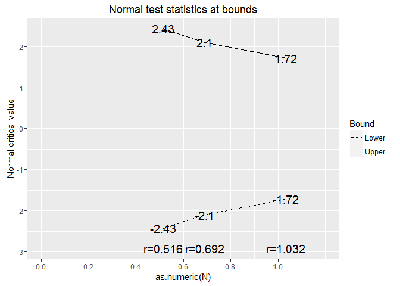

Group Sequential Design
================
Agustin Calatroni
Tue 11 Oct 2016

### Install package & Load Package

``` r
#install.packages("gsDesign")
library(gsDesign)
```

### Design

Symmetric, 2-sided design with O'Brien-Fleming-like boundaries lower bound is non-binding (ignored in Type I error computation) sample size is computed based on a fixed design requiring n=1952

``` r
m1 <- gsDesign(k = 3, timing = c(0.5, 0.67, 1), test.type = 2, alpha = 0.05, beta = 0.2, sfu = "OF", 
               n.fix = 1952, endpoint = "Binomial", delta0 = 0.105, delta1 = 0.069)
summary(m1)
```

    [1] "Symmetric two-sided group sequential design with 3 analyses, sample size 2016, 80 percent power, 5 percent (1-sided) Type I error. Bounds derived using a  O'Brien-Fleming boundary."

``` r
m1
```

    Symmetric two-sided group sequential design with
    80 % power and 5 % Type I Error.
    Spending computations assume trial stops
    if a bound is crossed.

                   
      Analysis   N   Z   Nominal p  Spend
             1 1008 2.43    0.0075 0.0075
             2 1351 2.10    0.0178 0.0126
             3 2016 1.72    0.0427 0.0299
         Total                     0.0500 

    ++ alpha spending:
     O'Brien-Fleming boundary.

    Boundary crossing probabilities and expected sample size
    assume any cross stops the trial

    Upper boundary (power or Type I Error)
              Analysis
       Theta      1      2      3 Total   E{N}
      0.0000 0.0075 0.0126 0.0299  0.05 1983.3
      0.0563 0.2589 0.2394 0.3018  0.80 1595.2

    Lower boundary (futility or Type II Error)
              Analysis
       Theta      1      2      3 Total
      0.0000 0.0075 0.0126 0.0299  0.05
      0.0563 0.0000 0.0000 0.0000  0.00

### Plot

``` r
m1 <- gsDesign(k = 3, timing = c(0.5, 0.67, 1), test.type = 2, alpha = 0.05, beta = 0.2, sfu = "OF")
plot(m1) + scale_x_continuous(limit = c(0,1.2), breaks = seq(0,1,0.2))
```


